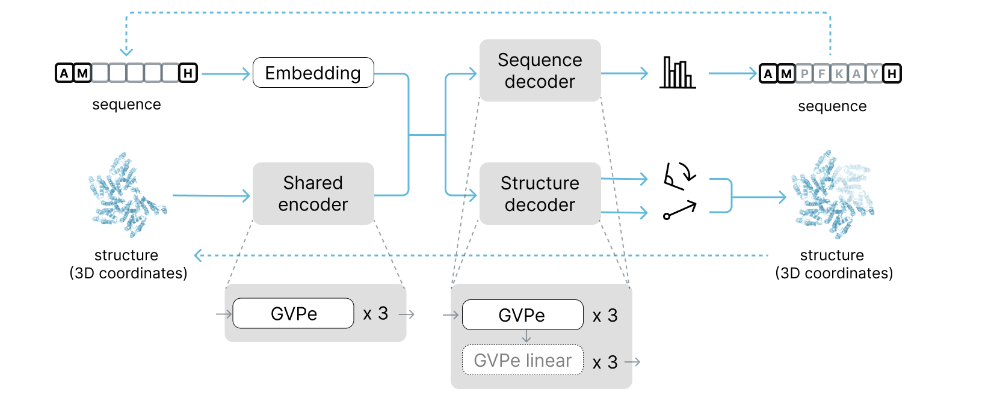
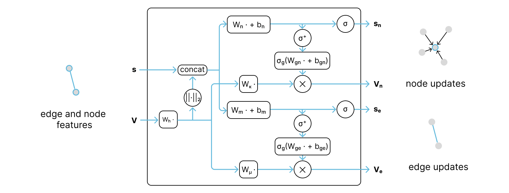

# ProtFill
`ProtFill` is an inpainting protein sequence and structure co-design model that works on antibodies as well as other proteins. 



Our model uses custom GVPe message passing layers, which are a modification of GVP with edge updates.



## Installation
```bash
cd protfill
conda create --name protfill python=3.10
conda activate protfill
python -m pip install .
```

## Data
The datasets can be downloaded from `proteinflow`.
```bash
proteinflow download --tag 20230102_stable

proteinflow download --tag 20230626_sabdab --skip_splitting
rm -r data/proteinflow_20230626_sabdab/splits_dict/
mv data/splits_dict data/proteinflow_20230626_sabdab/
proteinflow split --tag 20230626_sabdab
```

## Configs
There are four models in this repository and they can be tested or replicated with corresponding config files. The differences between the models are explained in the table below. Noising scheme here refers to either replacing the masked data with samples from a gaussian distribution (standard) or corrupting it with noise (alternative).

| Name                        | Dataset   | Diffusion | Noising scheme |
|-----------------------------|-----------|-----------|-----------------|
| protfill_ab                 | antibody  | no        | standard       |
| proftilldiff                | antibody  | yes       | standard       |
| protfill_ppi_standard_noising | diverse  | no          | standard       |
| protfill_ppi_alternative_noising | diverse | no        | alternative    |


## Training
In order to retrain one of the models, run this command with one of the config names.
```bash
protfill --config configs/train/NAME.yaml --dataset_path DATASET_PATH
```

An example can look like this.
```bash
protfill --config configs/train/protfill_ab.yaml --dataset_path data/proteinflow_20230626_sabdab
```

## Validation
In order to test on the 'easy' test subset, run the following.
```bash
protfill --config configs/test/NAME.yaml --dataset_path DATASET_PATH --easy_test
```

To test on the 'hard' subset, replace `--easy_test` with `--hard_test`. To test on a specific CDR, add e.g. `--test_cdr H3`. Note that the 'hard' antibody subset does not contain light chains and the diverse dataset does not have an 'easy' test subset.

## Generation
To redesign a part of a new file, run this. The file can have either a `.pdb` or  a `.pickle` extension, with the pickle files being generated by `proteinflow`.
```bash
protfill --config configs/test/NAME.yaml --redesign_file 7kgk.pdb
```

By default this command will redesign a random part of the protein. To redesign specific positions, use the `--redesign_positions` option. This argument should be in the format of `chain:start1-end1,start2-end2`, e.g. `A:5-10,20-21,30-40`. The numbering should be based on the fasta chain (0-indexed). The starts are included in the selected slice and the ends are not. The chain name is the author name, in case of PDB files.

